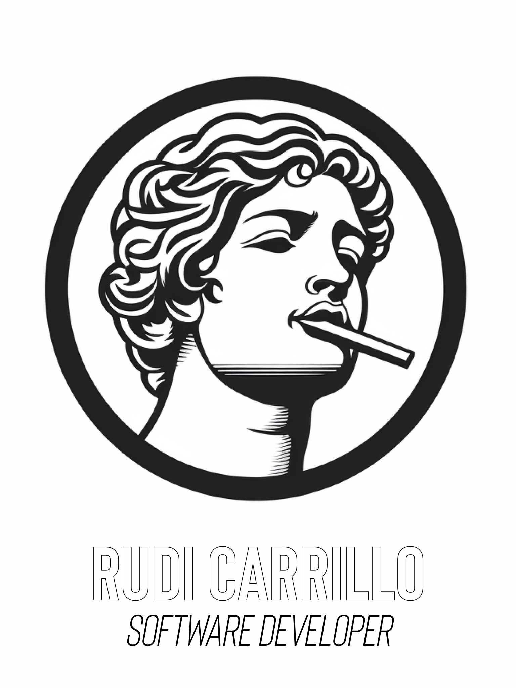

  

# Hi! I'm Rudi Carrillo 👋

I'm a Software Developer based in Xalapa, Mexico. I have a passion for creating and developing unique and minimalistic front and back end projects.

## 🔧 Technologies & Tools

<!---->

## 📈 GitHub Stats

## Pinned Repositories

1. [To Do List](https://github.com/rudicarrilloypr/todo-list): a basic To-Do List project built using webpack, JavaScript, HTML, and CSS.
[Live Demo](https://rudicarrilloypr.github.io/todo-list/dist/)
2. [R&B Music World Tour](https://github.com/rudicarrilloypr/capstone-module-1): project to test the learned skills into a conference page first module based on HTML, CSS and basic JavaScript. This project is part of the Microverse curriculum. The project contains a full description of an R&B Music World Tour.
[Live Demo](https://rudicarrilloypr.github.io/capstone-module-1/main.html)
3. [Awesome Books](https://github.com/rudicarrilloypr/awesome-books-es6): This project is about building a basic website that allows users to add/remove books from a list.
[Live Demo](https://rudicarrilloypr.github.io/awesome-books-es6/)

## 📫 How to reach me:
You can find all my contact information [here](https://lnk.bio/rudicarrillo_softdev).

You can also reach me by [email](mailto:rudicarrilloypr@gmail.com).
